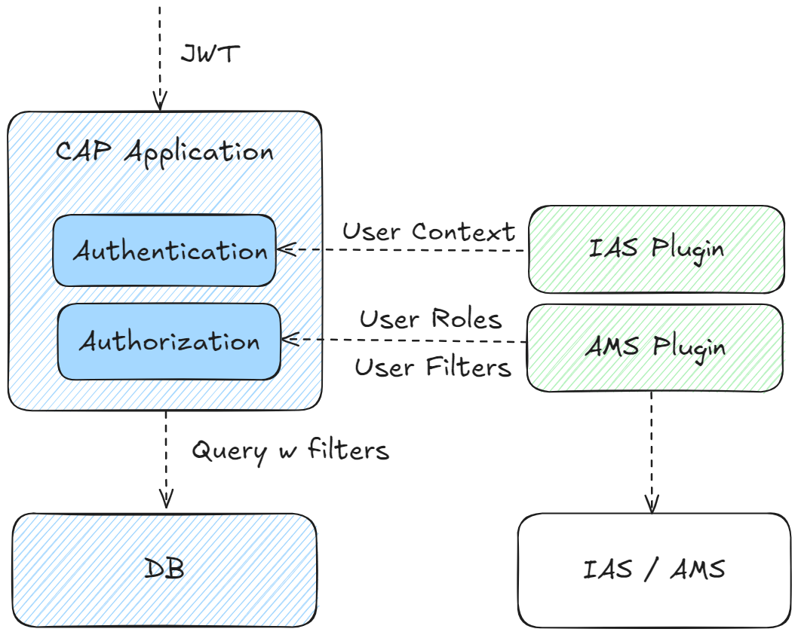

# Integrate With the Authorization Management Service

CAP is tightly integrated with Authorization Management Service (AMS). Applications that run with IAS-based authentication can benefit from AMS, which allows central access to policy management at the business level. The integration with AMS comes as an easy-to-consume plug-in for CAP applications.



The following section describes how to integrate your CAP application with the Authorization Management Service (AMS) using SAP Cloud Identity Service(IAS) as the identity provider.

You will be using `cds add ams` command to add the necessary dependencies and configurations to your CAP project.

The `cds add ams` automatically adds required configuration for IAS/AMS, considering the concrete application context (tenant mode and runtime environment, and so on).

- `cds add ias` - adds configuration for authentication via IAS
- `cds add ams` - adds configuration for authorization via AMS

## Configure AMS Integration in CAP Application

1. Execute the following command to add IAS and AMS configuration and dependencies to your project:

   ```shell
   cds add ams
   ```

2. Install the added dependencies:

   ```shell
   npm i
   ```

   In AMS, authorization policies are used to define concepts such as roles in a language called `Data Control Language` (DCL). To see the generated DCL files based on the CDS annotations, you need to build the project.

3. Build the project:

   ```shell
   cds build --production
   ```

   The build command generates the DCL files in the `ams/dcl/cap/basePolicies.dcl` and `gen/policies/dcl/cap/basePolicies.dcl` folder. The generated policies will look like this:

   ```cds
   POLICY "admin" {
   	ASSIGN ROLE "admin";
   }

   POLICY "support" {
   	ASSIGN ROLE "support";
   }
   ```

   The roles defined in `processor-service.cds` -> `annotate ProcessorService with @(requires: 'support');` has the corresponding policy `support` generated in the DCL file. Similarly, the `admin` role is also generated.

   Now, you can see that in `gen/srv/ams/dcl/cap/basePolicies.dcl` a policy `support` is generated. A user with the policy `cap.support` can view and update the Incidents.

## Configure Users for Local Testing

The authorization checks that you added to the CAP model apply not only when deployed to the cloud but also for local testing. Therefore, we need a way to log in to the application locally. To test it, **let's first add a wrong policy** to the user `alice`, to access incidents, support role is required, so we will assign the `admin` policy to the user `alice` to see the authorization error:

1. Update the following configurations for the `users` in the `package.json` with the following code:

   ```json
   "users": {
       "alice": {
         "policies" : [
             "cap.admin"
         ]
       },
       "bob": {
       }
   }
   ```

2. Open the application in your browser `http://localhost:4004/webapp/incidents` and log in with `username` as `alice`, leave the `password` field `empty`.

3. You should see an authorization error when trying to access the Incidents application because the user `alice` has the `admin` policy assigned, which does not allow access to the Incidents service.

   > [!TIP] 
   > Currently, there's no logout functionality. You can clear your browser's cache or simply close all browser windows to get rid of the login data in your browser. For Google Chrome, restart your browser (complete shutdown and restart) by entering `chrome://restart` in the address line.

   ```shell
   [error] - 403 - Error: Forbidden
       at requires_check (/Users/I329347/Coding/Dev-GuideQ4/incidents-app/node_modules/@sap/cds/lib/srv/protocols/http.js:54:32)
       at http_log (/Users/I329347/Coding/Dev-GuideQ4/incidents-app/node_modules/@sap/cds/lib/srv/protocols/http.js:42:59) {
     code: '403',
     reason: "User 'alice' is lacking required roles: [support]",
     user: User {
       id: 'alice',
       roles: { admin: 1 },
       policies: [ 'admin' ],
       authInfo: IdentityServiceSecurityContext { config: {} },
       is: [Function (anonymous)],
       amsRoles: [],
       [Symbol(AMS_AUTHORIZATIONS)]: Authorizations {
         ams: [AuthorizationManagementService],
         policySet: [Object],
         context: [EventContext],
         correlation_id: 'c9f8470e-59a5-4b8b-9af8-8f5ed57a785b',
         defaultInput: [Object],
         authorizationLimits: []
       }
     },
     required: [ 'support' ]
   }
   ```

   This shows that the AMS integration is working correctly, as the user `alice` is missing the required `support` role to access the Incidents service.

4. Update the user `alice` in the `package.json` to assign the correct policy and test, you should be able to access the Incidents application:

   ```json
   "users": {
       "alice": {
         "policies" : [
             "cap.support"
         ]
       },
       "bob": {
       }
   }
   ```

> [!TIP] 
> Here, the `policies` array can be used to assign policies to mocked users for local testing. The `roles` property of a user can still be used for manual role assignments to a mocked user. But since we want to test role assignments via AMS, we instead assign the policy for the support role.

