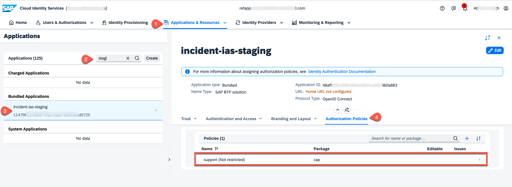
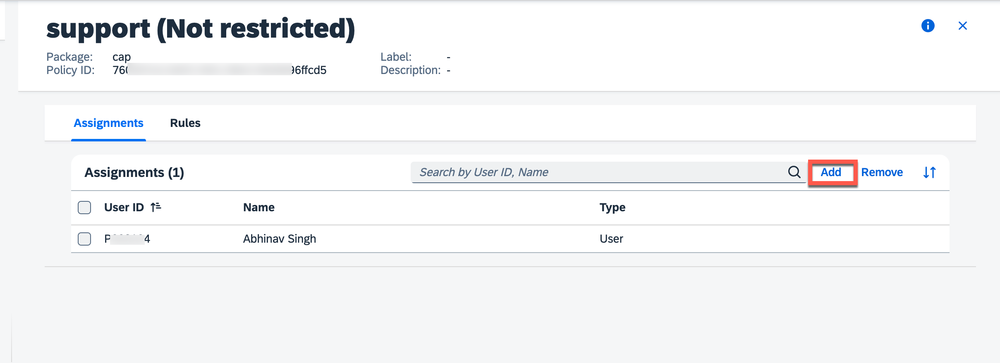
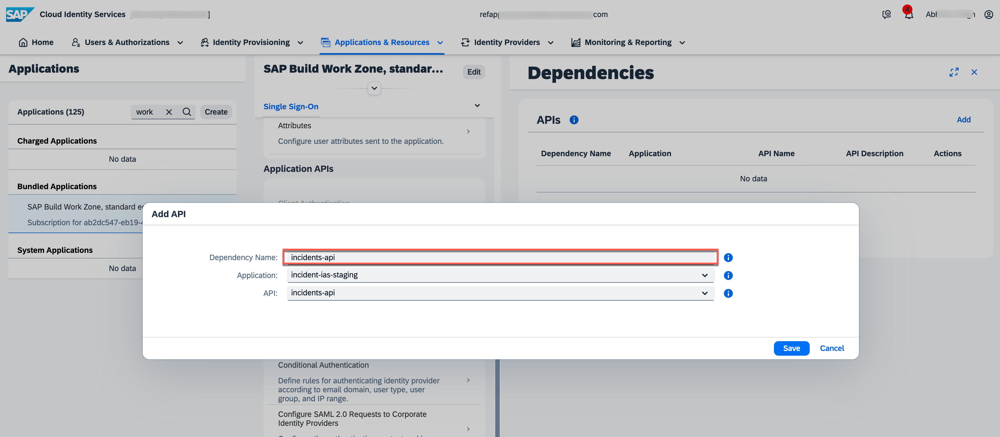

# Deploy and Run the Application on Cloud Foundry

## Prerequisites

Prepare your sample for deploying on Cloud Foundry: [Prerequisite-for-sample](./1-getting-started-with-ams.md).


## Add Identity Authentication and Authorization Management

 1. Create `ias-config.json` file in your project root folder with the following content and replace the ```<unique-id>``` with a unique value to identify your IAS app in IAS Tenant:

    ```
        {
          
            "authorization": {
              "enabled":true
            },
            "provided-apis": [
                {
                  "name": "incidents-api",
                  "description": "api exposed by incident mgmt app"
                }
              ],
            "display-name": "incident-ias-<unique-id>"
        }
    ```

2. Check if the following dependencies and dev dependencies have been added to the `package.json`:


    <!-- cpes-file package.json:$.cds.requires -->
    ```json 
    {
        ...
        "dependencies": {
        "@sap/ams": "^1.13.0",
        "@sap/cds": "^7.0",
        "@sap/xssec": "^3.3.5",
        "hdb": "^0.19.0",
        "passport": "^0"
      },
      "devDependencies": {
        "@sap/ams-dev": "^0.7.0",
        "@sap/cds-dk": "^7"
      },

    ...
    }
    ```
3. Change the `auth.kind` to `ias` in `package.json` for the production profile:

      ```
      {    
          ...
        "cds": {
          "requires": {
            "[production]": {
              ...
              "auth": {
                "kind": "ias"
                ...
              }
            }
          }
        }
      }
    ```

## Deploy on Cloud Foundry

1. Update the `mta.yaml` with the following content

- Change the dependency `incident-management-auth ` in `resources` from `xsuaa` service instance:
     ```
     - name: incident-management-auth
       type: org.cloudfoundry.managed-service
       parameters:
         config:
           tenant-mode: dedicated
           xsappname: incidents-${org}-${space}
         path: ./xs-security.json
         service: xsuaa
         service-plan: application
     ```
 
- To `ias` service instance:
     ```
       - name: incident-management-auth
         parameters:
           path: ./ias-config.json
           service-plan: application
           service: identity
         type: org.cloudfoundry.managed-service
     ```

  
- Add the following configurations to the `incident-management-srv` module

    - Change `incident-management-auth` service binding with `incident-management-srv` to: 
      ```
      - name: incidents-management-srv
        type: nodejs
        path: gen/srv
        requires:
        - name: incident-management-auth
          parameters:
            config:
               credential-type: "X509_GENERATED"
      ```
    - Update your buildpacks section by adding `OPA buildpack`
    
      ```
          parameters:
            buildpacks:
             - https://github.com/SAP/cloud-authorization-buildpack/releases/latest/download/opa_buildpack.zip
             - nodejs_buildpack
      ```
      
    - Add `AMS_DCL_ROOT` to `properties` section
    
      ```
        properties:
          AMS_DCL_ROOT: "ams/dcl"
      ```
  - Delete `incident-management-auth` binding from `incident-management-destination-content`
      ```
        - name: incident-management-auth
          parameters:
            service-key:
              name: incident-management-auth-key
      ```
  - Delete `incidents_incident_management_auth` destination from `incident-management-destination-content`
      ```
              - Authentication: OAuth2UserTokenExchange
                Name: incidents_incident_management_auth
                ServiceKeyName: incident-management-auth-key
                sap.cloud.service: incidents
      ```
      
  ### Note:
  
  Check if the module `incident-management-destination-content` in `mta.yaml` looks like this:
  
    ```
    - name: incident-management-destination-content
      type: com.sap.application.content
      requires:
        - name: incident-management-destination-service
          parameters:
            content-target: true
        - name: incident-management_html_repo_host
          parameters:
            service-key:
              name: incident-management_html_repo_host-key
        parameters:
          content:
            instance:
              destinations:
              - Name: incidents_incidents_management_html_repo_host
                ServiceInstanceName: incident-management-html5-app-host-service
                ServiceKeyName: incident-management_html_repo_host-key
                sap.cloud.service: incidents
              existing_destinations_policy: ignore
        build-parameters:
          no-source: true
    ```
- Update `incident-management-srv-api` in `incident-management-destination-service`

    - Add `HTML5.IASDependencyName: incidents-api`
    
      ```yaml 
          - Authentication: NoAuthentication
            HTML5.IASDependencyName: incidents-api
            Name: incidents-management-srv-api
            ProxyType: Internet
            Type: HTTP
            URL: ~{srv-api/srv-url}
          existing_destinations_policy: update
      ```
  - Update your `build-parameters ` with the following code:
      ```
        build-parameters:
          before-all:
          - builder: custom
            commands:
            - npx -p @sap/cds-dk cds build --production
            - npx -p cpy-cli -- cpy "ams" "./gen/srv"
      ```
2. Update `app/incidents/xs-app.json` with the following code:
   ```
      {
      "welcomeFile": "/index.html",
      "authenticationMethod": "route",
      "routes": [
        {
          "source": "^/odata/(.*)$",
          "target": "/odata/$1",
          "destination": "incident-management-srv-api",
          "authenticationType": "ias",
          "csrfProtection": false
        },
        {
          "source": "^/resources/(.*)$",
          "target": "/resources/$1",
          "authenticationType": "none",
          "destination": "ui5"
        },
        {
          "source": "^/test-resources/(.*)$",
          "target": "/test-resources/$1",
          "authenticationType": "none",
          "destination": "ui5"
        },
        {
          "source": "^(.*)$",
          "target": "$1",
          "service": "html5-apps-repo-rt",
          "authenticationType": "ias"
        }
      ]
    }
   ```

   > Change the  `authenticationType ` of `incident-management-srv-api` and `html5-apps-repo-rt` from `xsuaa` to `ias`

   
6. Build the mtar.
    ```
    mbt build
    ```
    
7. Log in to your SAP BTP subaccount and choose your Cloud Foundry space where you want to deploy your application.

    ```
    cf login -a <api-endpoint>
    ```
    
8.  Deploy on Cloud Foundry.

    ```
    cf deploy mta_archive/<mtar_name>.mtar
    ```

After successful deployment, you can go to **SAP BTP Cockpit -> your subaccount and your space** and see your application as well as bound services.

## Check Your IAS Application and Uploaded AMS Policies.

- Log in to your IAS Tenant and go to **Applications & Resources**.
- Search and select your application with `incident-ias-<unique-id>` (in this case its `incident-ias-staging`).
- Check the uploaded dcl policies under **Authorization Policies**.
    <br />
    
- Assign users to your policies.
    <br/>   

## Set Up Application to Application Communication

The application has [app2app navigation](https://help.sap.com/docs/build-work-zone-standard-edition/sap-build-work-zone-standard-edition/switching-to-sap-cloud-identity-services-identity-authentication#app-to-app-navigation) configuration where the CAP back end with IAS-based authentication exposes an API that is configured as a dependency of the SAP Biuld Workzone’s IAS application. The `IASDependencyName` is then defined in the GACD Destination Deployer module configuration.

### Update OpenID Connect Configuration

  - Log in to your SAP Cloud Identity Services admin console.
  - Go to **Applications & Resources**.
  - Search for your application bound to your CAP backend (in this case its `incident-ias-staging`).
  - Go to **Trust -> OpenID Connect Configuration -> Advanced Settings -> Access Token Format**. Choose **JSON Web Token** and **Save**.
  

### Set Up Communication

  - Log in to your SAP Cloud Identity Services admin console.
  - Go to **Applications & Resources**.
  - Search for your IAS application bound to your CAP backend (in this case it's `incident-ias-staging`).
  - Verify that the endpoint exposed by your application is listed in **Application APIs -> Provided APIs**.
   
  - Search and select your SAP Build Work Zone Workzone application in **SAP Build Work Zone, standard edition -> Application APIs -> Dependencies**. Choose **Add** a dependency.
   

  - Give the dependency the same name as the one you provided in the `destination service configuration property` in the `mta.yaml`.
    ```
     HTML5.IASDependencyName: incidents-api
    ```
  - For each application, select the IAS application bound to your CAP backend (in this case, it's `incident-ias-staging`).
  - Select the exposed endpoint (in this case, its `incidents-api`), and choose **Save**.
    

## Access Your Application
To access the application in launchpad, proceed to [Integrate with SAP Build Workzone, standard edition](https://developers.sap.com/tutorials/integrate-with-work-zone.html).

