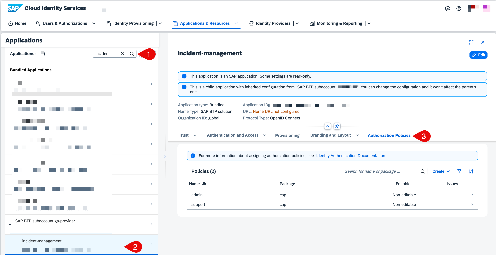
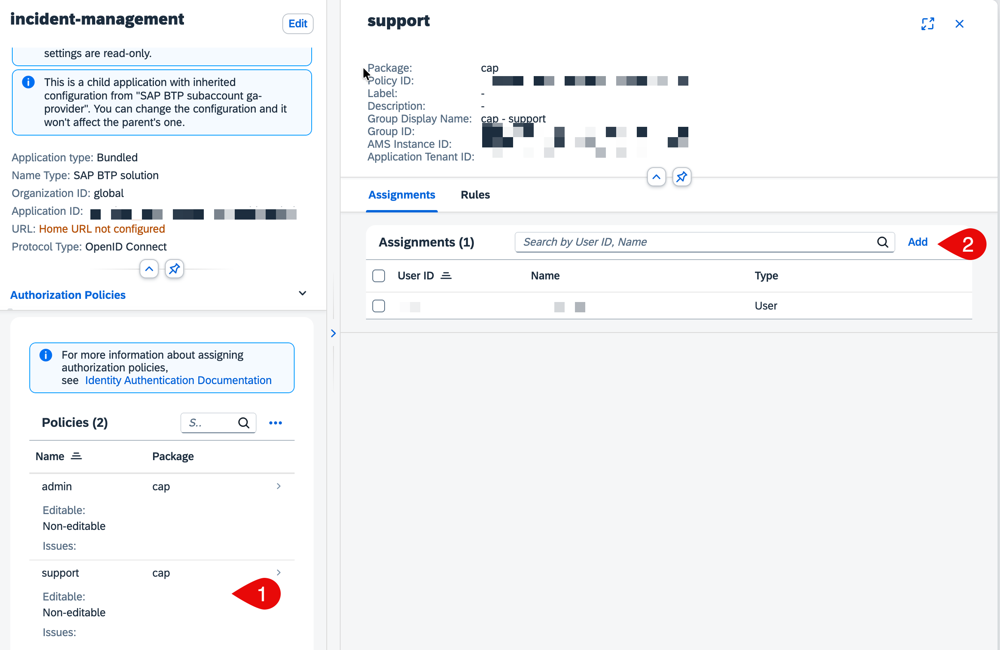
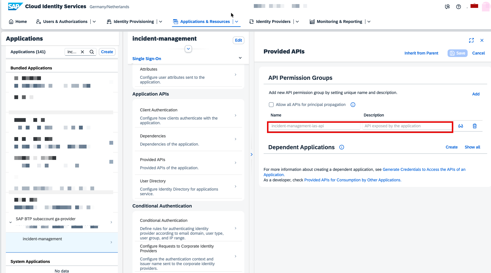
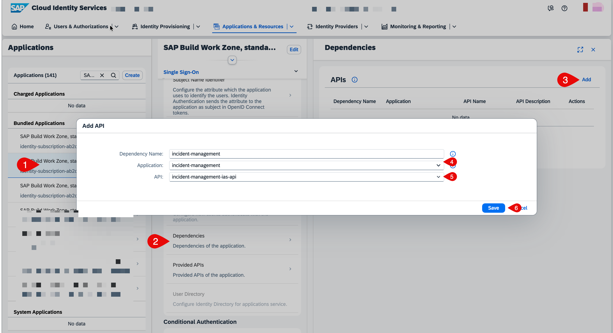

# Assign Policies and Access to the Application

## Assign Policies to Users in SAP Cloud Identity Services (IAS) Tenant 
1. Log in to your IAS Tenant and go to **Applications & Resources**.
2. Search and select your application with `incident-management-<unique-id>` (in this case its `incident-management`).
3. Check the uploaded dcl policies under **Authorization Policies**.
    <br />
    
- Select the role, for example, `support` role, choose **Add**
- Select your user and choose **Add** to assign the role to the user.
    <br/>

## Set Up Application to Application Communication

The application has an [app2app navigation](https://help.sap.com/docs/build-work-zone-standard-edition/sap-build-work-zone-standard-edition/switching-to-sap-cloud-identity-services-identity-authentication#app-to-app-navigation) configuration where the CAP back end with IAS-based authentication exposes an API that is configured as a dependency of the SAP Build Workzone’s IAS application. 

The `IASDependencyName` is then defined in the GACD Destination Deployer module configuration.


### Set Up Application to Application Communication in SAP Build Work Zone

  - Into your SAP Cloud Identity Services admin console.
  - Go to **Applications & Resources**.
  - Search for your IAS application bound to your CAP backend (in this case it's `Incident-Management`).
  - Verify that the endpoint exposed by your application is listed in **Application APIs -> Provided APIs**.
   
  - Search and select your SAP Build Work Zone Workzone application in **SAP Build Work Zone, standard edition -> Application APIs -> Dependencies**. Choose **Add** a dependency.
  - Give the dependency the same name as the in the `mta.yaml`.
    ```yaml
     provided-apis:
        - name: incident-management-ias-api
    ```
  - Select the IAS application bound to your CAP backend (in this case, it's `incident-management`).
  - Select the exposed endpoint (in this case, its `incident-management-ias-api`), and choose **Save**.
    

## Access Your Application
- To access the application in launchpad, proceed to [Integrate with SAP Build Workzone, standard edition](https://developers.sap.com/tutorials/integrate-with-work-zone.html).

